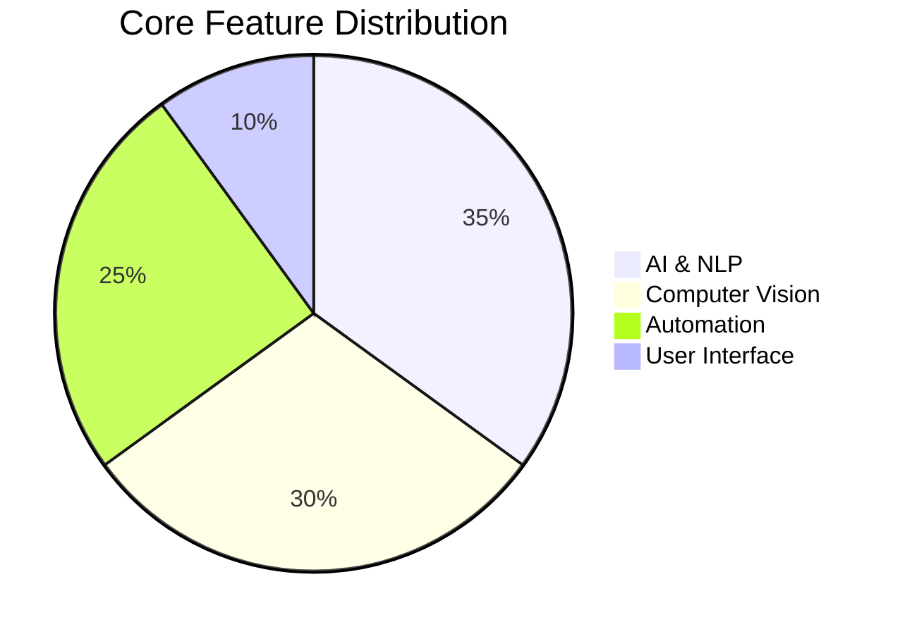
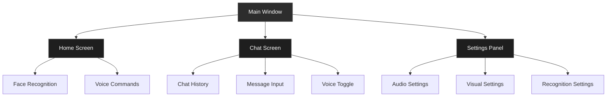

# 🤖 Jarvis AI Assistant - Your Intelligent Digital Companion

<div align="center">
  <h1>Jarvis AI Assistant</h1>
  <p>A cutting-edge AI assistant combining facial recognition, voice interaction, and advanced automation capabilities</p>
  
  [](https://www.python.org/)
  [](LICENSE)
  []()
  []()
  []()
</div>

## 🌟 Features Overview

| Category | Features |
|----------|----------|
| **🧠 AI Capabilities** | Natural Language Processing, Voice Interaction, Web Search, Predictive Assistance |
| **👁️ Computer Vision** | Facial Recognition, Emotion Detection, Object Detection, Gesture Control |
| **⚙️ Automation** | System Monitoring, Battery Tracking, WhatsApp Integration, File Operations |
| **🎨 Modern GUI** | Dark Theme, Real-time Status, Chat Interface, Accessibility Features |



## 🎯 Pros and Cons Analysis

### ✅ Pros

1. **Comprehensive Feature Set**
   - Rich integration of AI, computer vision, and automation capabilities
   - Multiple interaction modes (voice, text, gestures)
   - Advanced facial recognition and emotion detection
   - Real-time system monitoring and battery tracking

2. **Modern Architecture**
   - Well-organized modular structure
   - Clear separation between frontend and backend
   - Extensible design pattern
   - End-to-end encryption support

3. **User Experience**
   - Intuitive GUI with dark theme
   - Multiple accessibility features
   - Real-time status updates
   - Cross-platform compatibility

4. **Integration Capabilities**
   - WhatsApp integration for messaging and calls
   - Web search functionality
   - File operations and automation
   - Contact management system

5. **Security Features**
   - Facial recognition authentication
   - Privacy mode implementation
   - Secure key storage
   - Data protection mechanisms

### ❌ Cons


2. **Dependencies**
   - Relies on numerous external libraries
   - Complex installation process
   - Version compatibility issues possible
   - Internet connection required for many features

3. **Setup Complexity**
   - Multiple configuration steps needed
   - API keys required for various services
   - Directory structure setup required
   - Initial facial recognition training needed

4. **Limited Platform Support**
   - Primary focus on Windows 10/11
   - Some features may not work on other operating systems
   - Hardware requirements (webcam, microphone) mandatory
   - Limited mobile device support

5. **Maintenance Challenges**
   - Regular updates needed for AI models
   - Log file management required
   - Generated content cleanup necessary
   - System health monitoring needed

## ⚡ Quick Start

### 📋 Prerequisites
```markdown
✓ Python 3.8 or higher
✓ Windows 10/11
✓ Webcam & Microphone
✓ Internet Connection
```

### 🚀 Installation
```bash
# Clone the repository
git clone [repository-url]
cd jarvis

# Install dependencies
python install_dependencies.py
# OR
pip install -r Requirements.txt

# Launch Jarvis
python Main.py
```

## 🏗️ Project Architecture

```bash
jarvis/
├── 🧠 Backend/           # Core AI & automation
├── 🎨 Frontend/          # Modern GUI components
├── 📊 Data/              # Data resources
├── 🤖 models/            # AI/ML models
├── ⚙️ config/            # Configuration files
├── 📝 logs/              # System logs
├── 🔧 generated_code/    # Auto-generated content
├── 🖼️ generated_images/  # Generated images
├── 🔐 secure_keys/       # Security & encryption
└── 🧹 cleanup_scripts/   # Maintenance utilities
```

## 💡 Key Features Deep Dive

### 🤖 AI Assistant Capabilities
- 🗣️ Natural language understanding
- 🔊 Voice-based interaction
- 🌐 Real-time web search
- 📱 WhatsApp integration
- 🧮 Pattern recognition
- 🔒 End-to-end encryption

### 👁️ Computer Vision Features
- 👤 Facial recognition auth
- 😊 Emotion detection
- 🖐️ Hand gesture control
- 📷 Object detection
- 🎥 Real-time processing

### ⚙️ System Integration
- 💻 System health tracking
- 🔋 Battery monitoring
- 📱 App automation
- 📞 Contact management
- 📁 File operations

## 🛠️ Configuration

### 🔧 Environment Setup
1. Create required directories:
   ```bash
   mkdir generated_code generated_images logs models
   ```

2. Configure API keys:
   ```bash
   # Set up secure keys
   cp .env.example .env
   # Edit .env with your API keys
   ```

### ⚙️ Customization
```json
{
  "gesture_control": true,
  "voice_commands": true,
  "dark_theme": true,
  "language": "en"
}
```

## 🔍 Troubleshooting Guide

<details>
<summary>🎥 Facial Recognition Issues</summary>

- ✔️ Check proper lighting
- ✔️ Verify webcam permissions
- ✔️ Update training data
</details>

<details>
<summary>🎤 Voice Recognition Issues</summary>

- ✔️ Test microphone settings
- ✔️ Check audio input
- ✔️ Minimize background noise
</details>

<details>
<summary>🔌 System Integration Issues</summary>

- ✔️ Verify file permissions
- ✔️ Check API keys
- ✔️ Test internet connection
</details>

## 🤝 Contributing

We welcome contributions! Follow these steps:

1. 🍴 Fork the repository
2. 🌿 Create your feature branch
   ```bash
   git checkout -b feature/AmazingFeature
   ```
3. 💾 Commit your changes
   ```bash
   git commit -m 'Add amazing feature'
   ```
4. 📤 Push to the branch
   ```bash
   git push origin feature/AmazingFeature
   ```
5. 🔄 Open a Pull Request

## 🔐 Security Features

- 🔒 End-to-end encryption
- 🗝️ Secure key storage
- 🕶️ Privacy mode
- 🔑 Access control
- 🛡️ Data protection

## 📜 License

This project is licensed under the MIT License - see the [LICENSE](LICENSE) file for details.

## 👏 Acknowledgments

- 🙌 Contributors and maintainers
- 📚 Third-party libraries
- 🛠️ Development tools

## 📊 Version History

Check `version.json` for detailed version information.

---

<div align="center">
  Made with ❤️ by the Jarvis Team
  <br>
  <a href="https://github.com/yourusername/jarvis/issues">Report Bug</a>
  ·
  <a href="https://github.com/yourusername/jarvis/issues">Request Feature</a>
</div>

## 🎮 Quick Code Example

```python
# Initialize Jarvis with facial recognition
from jarvis.core import JarvisAI
from jarvis.vision import FaceRecognition

# Create Jarvis instance
jarvis = JarvisAI()

# Initialize facial recognition
face_recognition = FaceRecognition()

# Start interaction
jarvis.start()
```

## 📫 Contact & Support

Need help? Got questions? Want to contribute?

- 📧 Email: [contact@jarvis-ai.com](mailto:contact@jarvis-ai.com)
- 💬 Discord: [Join our community](https://discord.gg/jarvis)
- 🌟 GitHub: [Star us](https://github.com/yourusername/jarvis)

# Facial Recognition Application with Jarvis AI Assistant

This is a facial recognition application with Jarvis AI assistant that uses your webcam to detect and recognize faces. The application can identify people whose face images are provided and includes an advanced AI assistant with speech recognition and automation capabilities.

## Prerequisites

This application requires the following Python packages:
- OpenCV (`opencv-python`)
- face_recognition
- NumPy
- And other dependencies listed in Requirements.txt

You can install these packages using pip:
```
pip install -r Requirements.txt
```

## Features

### Facial Recognition
- Face detection and recognition
- User authentication via facial recognition
- Training mode to add new faces

### Jarvis AI Assistant
- Voice-based interaction
- Natural language understanding
- Web search capabilities
- Application automation
- Text-to-speech responses
- Content generation

## How to Set Up

1. **Prepare face images**: 
   - Save at least one face image in the same directory as the script
   - Name your images "known_person.jpg" and "known_person2.jpg" (or modify the script to use your own file names)
   - Each image should contain a clear, well-lit picture of a single person's face

2. **Run the application**:
   ```
   python Main.py
   ```

3. **Using the application**:
   - The application will open your webcam and start detecting faces
   - Recognized faces will have a box drawn around them with the person's name
   - Unknown faces will be labeled as "Unknown"
   - Once authenticated, Jarvis AI assistant will be available

## Operation Modes

The application has two modes:

1. **Recognition Mode**: When sample images are loaded successfully, the app will recognize faces and match them against known faces.

2. **Detection-Only Mode**: If no sample images are found or loaded, the app will run in detection-only mode, where it will detect faces but label all of them as "Detected Face".

## Customizing

To recognize different people or more people:
1. Add more image files
2. Modify the script to load these additional images
3. Add corresponding names to the `known_face_names` list

## Troubleshooting

### Missing Image Files
- If you see a warning about missing image files, make sure your face images are in the same directory as the script

### Webcam Issues
- If the webcam doesn't open or shows errors about grabbing frames:
  - Make sure your webcam is connected and working properly
  - Check if any other application is using the webcam (close them)
  - Try restarting your computer
  - If you're on Windows, check your privacy settings to ensure Python has permission to access the camera
  - Try using a different webcam by changing the parameter in `cv2.VideoCapture(0)` to `cv2.VideoCapture(1)` or another number

### Recognition Issues
- If faces are not being recognized properly:
  - Try improving the lighting conditions 
  - Use higher quality reference images
  - Make sure the face is clearly visible in your reference images
  - Try different angles or expressions in your reference images 

## GUI Interface

### Visual Overview

The Jarvis interface is organized into several key components as shown in the diagram below:



### Interface Components

1. **Home Screen**
   - Face Recognition Display: Real-time webcam feed with face detection
   - Status Indicators: System state and recognition status
   - Quick Action Buttons: Common commands and settings

2. **Chat Screen**
   - Message History: Scrollable chat interface with user and Jarvis messages
   - Input Area: Text input field with voice command toggle
   - Response Display: Formatted AI responses with syntax highlighting for code

3. **Settings Panel**
   - Audio Configuration: Microphone selection and volume controls
   - Visual Preferences: Theme selection and display options
   - Recognition Settings: Face detection sensitivity and training options

### Theme and Design

The interface uses a modern dark theme with:
- Background: Dark gray (#2d2d2d)
- Text: Light gray for better readability
- Accent Colors:
  - Primary: #007AFF (Blue)
  - Success: #28a745 (Green)
  - Warning: #ffc107 (Yellow)
  - Error: #dc3545 (Red)

### Accessibility Features

- High contrast mode available
- Keyboard navigation support
- Screen reader compatibility
- Adjustable text size
- Color-blind friendly indicators

## GUI Improvements (Latest Update)

The Jarvis GUI has been completely redesigned with a modern dark theme and improved usability:

### New Features
- **Modern Dark Theme**: Sleek dark background with color-coded elements for better readability
- **Card-Based Layout**: All elements are contained in floating cards with drop shadows
- **Improved Status Indicators**: Visual feedback for system states (listening, processing, error)
- **Animated Elements**: Smooth animations for microphone toggling and status indicators
- **Better Chat Experience**: Redesigned chat section with improved formatting and scrolling
- **Window Controls**: Added proper window management with minimize and close buttons
- **Keyboard Shortcuts**: Added more keyboard shortcuts for improved navigation
  - Ctrl+H: Home screen
  - Ctrl+C: Chat screen
  - Ctrl+S: Settings panel
  - Ctrl+M: Turn microphone off
  - Ctrl+U: Turn microphone on
  - Escape: Exit application

### Technical Improvements
- Optimized animations and transitions for better performance
- Fixed file path issues to use relative paths instead of absolute paths
- More intuitive microphone toggle with visual feedback
- Improved error handling with proper exception logging
- Unified color theme with global color variables for consistency
- Responsive layout that adapts to different screen sizes
- Better component organization for easier maintenance
- Fixed QLayout warnings by correctly structuring widget hierarchy
- Enhanced error handling and recovery for better stability

## Launching the GUI

There are multiple ways to start the Jarvis GUI:

### Standard Launch (Recommended)
```
python launch_gui.py
```
This uses the enhanced launcher that provides better error handling and logging.

### Direct Launch
```
python Frontend/GUI.py
```
Direct launch without additional error handling.

### Troubleshooting

If the GUI fails to launch or crashes:

1. **Check the logs directory** - Error logs are saved in the `logs` folder
2. **Missing graphics files** - The launcher should automatically create required data files, but you may need to manually copy missing image files to the `Frontend/Graphics` directory
3. **Python path issues** - Use the launcher script which automatically sets up the proper Python path
4. **Window visibility issues** - The GUI is set to show at 80% of your screen size. If you don't see the window, try pressing Alt+Tab to cycle through windows 

# Code Generator Bot using Groq API

A command-line tool that generates code based on user prompts using the Groq API.

## Setup

1. Install the required dependencies:
```bash
pip install -r requirements.txt
```

2. Set up your Groq API key as an environment variable:
```bash
# On Windows (PowerShell)
$env:GROQ_API_KEY="your-api-key-here"

# On Windows (Command Prompt)
set GROQ_API_KEY=your-api-key-here

# On Linux/MacOS
export GROQ_API_KEY="your-api-key-here"
```

## Usage

Run the code generator by providing your prompt as a command-line argument:

```bash
python Backend/code_generator_bot.py "write a function that calculates fibonacci sequence"
```

The tool will generate code based on your prompt and display it in the console.

## Features

- Uses Groq's Mixtral-8x7b model for code generation
- Generates well-documented and efficient code
- Includes necessary imports and explanations
- Simple command-line interface

## Notes

- Make sure your Groq API key is properly set before running the tool
- The generated code quality depends on the clarity and specificity of your prompt
- The tool requires an active internet connection to communicate with the Groq API 